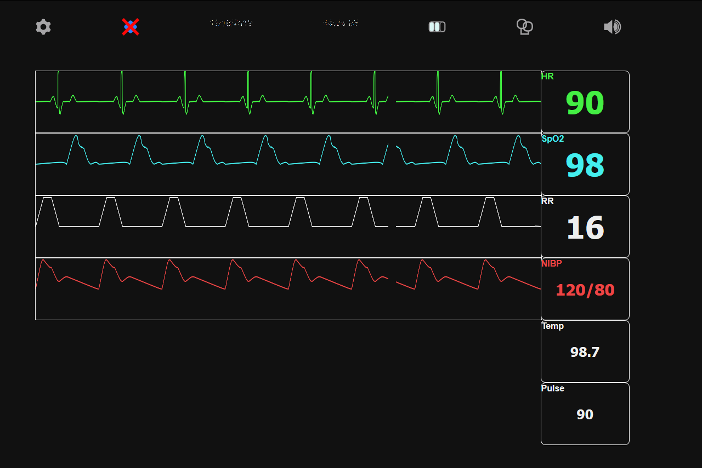

# 

A customizable, web-based simulation monitor for vital signs.
It is built to run with HTML5, CSS3, and ECMAScript 5.
You can view the demo [here](http://www.joshuaspann.com/sim-monitor)!

Tested and working on Firefox 70, Edge 42, and Chrome 78.

## Features

The latest release demo is `index.htm`, which has all external files (except images) packed into it.
You can copy `index.htm` along with the `res/` folder to run it on nearly any web browser.

- Adjustable vital sign values
- Selectable waveforms
- Animated waves
- Current date and time in `HH`:`MM`:`SS` format
- Easily extendable

- Simple UI
- Cross-platform, web app
- Works within current web browsers
- Single-file implementation for easy transfer across devices
- Free and forever open-source

### Waveforms
- Sinus (Lead II)
- Pacemaker (Lead II)
- VFib (Lead II)
- AFib (Lead I)

- Normal Pleth
- Small/Weak (Pleth)
- Large/Bounding (Pleth)
- Pulsus Alternase (Pleth)
- No Dicrotic Notch (Pleth)
- Chaotic (Pleth)

- Basic Respiration
- Normal Artline

## Documentation

For customizing and extending the functionality of the simulation monitor, take a look at [the documentation and API guide](docs/index.md).

## License

This project is released under the [GNU General Public License v2.0](LICENSE).

