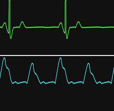

# Sim Monitor Documentation

## Waveforms

**NOTE**: Waveforms only render inside of a canvas element!

### Default Waveforms

Sim Monitor comes with a few default waveforms that try to match the most common ones you'd encounter.
As a disclaimer, these waves are gross approximations based off of common online search results.
They may not properly match what is seen in real life.
If there is an issue, suggest changes on the [issues page](https://github.com/JoshuaSpann/sim-monitor/issues) or make a pull request for an improved waveform.

#### Heart Rhythms

Heart rhythms can be accessed via the waveformsHr object.
Currently the included waveforms are:
- Sinus (Lead II)
- AVP (Lead II)
- VFib (Lead II)
- AFib (Lead I)

#### Oxygen Waves

Oxygen waves can be accessed via the waveformsO2 object.
Currently the included waveforms are:
- Normal
- Small & Weak
- Large & Bounding
- Pulsus Alternanse
- No Dicrotic Notch
- Chaotic

---

## Waveforms API

### Fields and Properties

- `amplitude`: Controls the amplitude of the wave. It multiplies the y-axis values.
- `color` [optional]: The color value to set the waveform to in hexadecimal format.
- `cycle`: Sets the scale for when the wave is rendered in a container. A placeholder value that is used to establish the size of a waveform's single cycle within its container.
- `linear` [optional]: Causes the waveform to render in straight lines instead of curves.
- `name` [optional]: The display name of the waveform.
-`pathCoordinates`: An array of x-y coordinates that is used to draw the waveform's path. The first set of coordinates are the starting point of the wave in its parent container.

### Adding

You can add a custom waveform by creating the shape in JavaScript.
The waveform itself is defined in an array of x,y coordinates.
The entire grouping of coordinates is set by default to be one cycle.
The first set of coordinates is the start point, subsequesnt ones are x,y values that you add to the current x,y coordinates:
All coordinates are relative to the start point and the previous set of coordinates in the list.

#### Required Object Properties and Format

To create a waveform, declare a JavaScript object and ensure that the waveform object has the following fields: `amplitude`, `cycle`, `pathCoordinates`.
Other fields, like `color`, `linear`, `name`, `curve` are optional.

```JavaScript
let waveform = {
	amplitude: 1,
	color: '#eee',
	cycle: {
		length: 100,
		height: length*0.29
	},
	linear: true,
	name: 'NIBP',
	pathCoordinates: [
		//StartPoints
		[0,0],
		// PathCoordidates
		[2,95],
		[2,0],
		[2,-95],
		[10,0]
	]
}
```

The waveform coordinates are part of the overall waveform object.
Parameters such as curves, smoothness, and randomness are set with the waveform object and are applied when drawn to the canvas via the API.

### Implementing

To draw a waveform, declaure the object as shown in [the example](#required-object-properties-and-format).
If you prefer to simply draw the static waveform with no animation, call `renderWaveInCanvas`.
If you want an animated waveform, call the API's `animateWaveformContext` function with the first parameter as the waveform, the second parameter as the DOM canvas element, and the optional third parameter for setting the animation speed (in miliseconds):

```JavaScript
// Will apply the waveform inside of the canvas element. Safe-exits if not a canvas with a 2D context
animateWaveformContext(waveform, document.querySelector('canvas'), 30)
renderWaveInCanvas(waveform, document.querySelector('canvas'))
```

#### The `curve` Property

The `curve` prop is a special object that determines if the waveform is rendered with smoothing and curves or if it is to appear linear by default.

##### Smoothness
`curve` has 3 properties to control curve smoothness:
- `smooth`: Sets control point smoothness along both the curve's x-axis and y-axis
- `smoothX`: Sets control point smoothing along curve's x-axis only
- `smoothY`: Sets control point smoothness along curve's y-axis only

Each of these properties can be set as a single number or an array of 2 numbers.
A single number applies bezier-point smoothing for both control points.
An array applies bezier-point smoothing for each individual control point based off of its array index.

#### The `cycle` Property

The `cycle` prop is used to specify the cycle/phase length properties that draw the waveform.
There are 2 mandatory sub-properties and the rest are optional:
- `height`: The height of the waveform cycle when drawn in the canvas, based on the length
- `length`: The length of the waveform cycle when drawn in the canvas
- `span`: Squashes/stretches how many cycles the waveform's path should cover
    - 
    - 

#### The `linear` Property

The `linear` prop controls whether to render the waveform in a linear-graph style or not.
By default, all waveforms are assumed to have a curve to them.


The default value is to smooth the x and y curve control points by a value of `2`.
If `linear` is set, then it accomplishes the same thing as setting `curve.smooth` equal to `0`.

